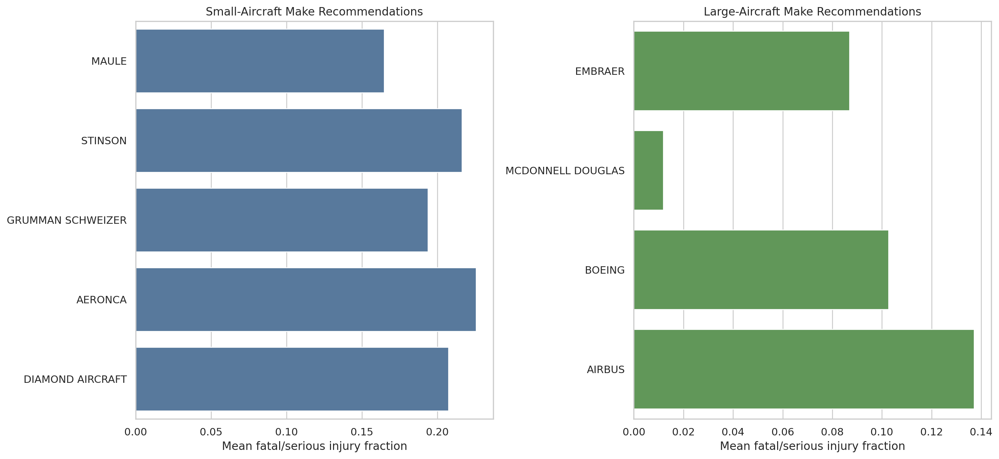
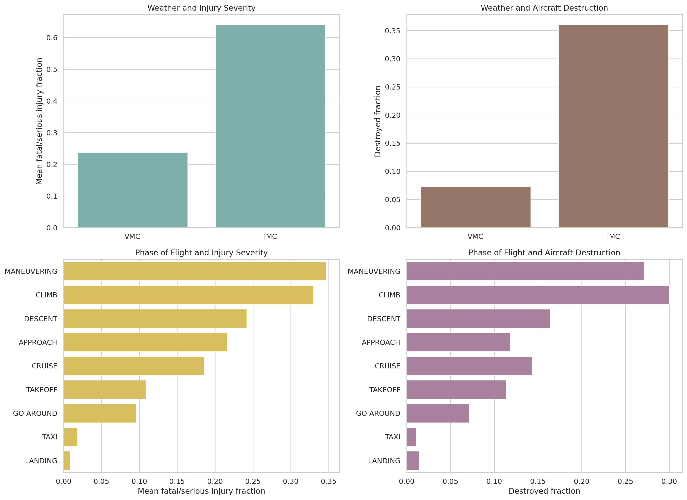

# Aviation Accident Analysis

This project uses cleaned U.S. aviation accident data from `1983-2023` to look for airplane makes and models with lower injury severity and lower rates of total aircraft destruction.

I separated the analysis into two groups:

- Small airplanes: below the project threshold of 20 passengers.
- Large airplanes: higher-capacity passenger aircraft.

I focused on two main measures:

- `Fatal.Serious.Fraction`: the share of passengers who were fatally or seriously injured.
- `Destroyed`: whether the aircraft was totally destroyed.

To avoid making recommendations from very small samples, I used minimum observation cutoffs in the grouped analysis:

- Make and model comparisons in the notebook use at least `10` accidents per subgroup.
- Weather and phase-of-flight comparisons use at least `50` accidents per subgroup.
- The cleaning notebook also removes makes that are too sparse overall before the analysis notebook is run.

## Recommendation Summary

### Small-aircraft make recommendations

These were the strongest small-aircraft makes based on injury outcomes and destruction rates:

| Make | Sample size | Mean fatal/serious injury fraction | Destroyed fraction |
| --- | ---: | ---: | ---: |
| MAULE | 215 | 0.165 | 0.042 |
| STINSON | 129 | 0.216 | 0.023 |
| GRUMMAN SCHWEIZER | 98 | 0.194 | 0.051 |
| AERONCA | 200 | 0.226 | 0.035 |
| DIAMOND AIRCRAFT | 98 | 0.207 | 0.051 |

Based on this analysis, `MAULE` is my top small-aircraft make recommendation. It performed well on both measures and also had a solid sample size.

### Large-aircraft make recommendations

There were fewer large-aircraft makes with enough data, so this comparison is based on four manufacturers:

| Make | Sample size | Mean fatal/serious injury fraction | Destroyed fraction |
| --- | ---: | ---: | ---: |
| EMBRAER | 68 | 0.087 | 0.059 |
| MCDONNELL DOUGLAS | 50 | 0.012 | 0.080 |
| BOEING | 386 | 0.103 | 0.088 |
| AIRBUS | 100 | 0.137 | 0.130 |

At the make level, `EMBRAER` and `MCDONNELL DOUGLAS` had the best overall results. `BOEING` is also important here because it has the largest sample by far, so that result is backed by much more data.

### Small-aircraft model recommendations

These were the best-supported small-aircraft make/model combinations in the executed notebook:

| Make / model | Sample size | Mean fatal/serious injury fraction | Destroyed fraction |
| --- | ---: | ---: | ---: |
| CESSNA 172SP | 12 | 0.000 | 0.000 |
| MAULE M 5 210C | 11 | 0.000 | 0.000 |
| PIPER PA 18A 150 | 20 | 0.025 | 0.000 |
| BEECH A23 24 | 10 | 0.025 | 0.000 |
| CESSNA 180J | 27 | 0.037 | 0.000 |

For small airplanes, `CESSNA 172SP`, `MAULE M 5 210C`, and `PIPER PA 18A 150` are at the top of the current model-level ranking. I would still read those results with some caution because the first two models only clear the minimum sample threshold by a small margin.

### Large-aircraft model recommendations

Large-aircraft model recommendations were more limited by sample size, but these models performed best among groups with at least 10 accidents:

| Make / model | Sample size | Mean fatal/serious injury fraction | Destroyed fraction |
| --- | ---: | ---: | ---: |
| BOEING 777 | 19 | 0.002 | 0.053 |
| BOEING 757 | 16 | 0.002 | 0.000 |
| EMBRAER EMB 145LR | 13 | 0.050 | 0.000 |
| BOEING 737 7H4 | 21 | 0.057 | 0.000 |
| BOEING 767 | 26 | 0.150 | 0.115 |

For large airplanes, `BOEING 777` and `BOEING 757` had the strongest observed results. `EMBRAER EMB 145LR` and `BOEING 737 7H4` also performed well, although they are based on smaller samples than the broader `BOEING 737` family.

## Factors Affecting Injury and Damage Outcomes

### 1. Weather condition

Weather had a clear effect on accident outcomes:

| Weather condition | Sample size | Mean fatal/serious injury fraction | Destroyed fraction |
| --- | ---: | ---: | ---: |
| VMC | 14,306 | 0.238 | 0.073 |
| IMC | 896 | 0.641 | 0.360 |

`IMC` accidents had much worse outcomes than `VMC` accidents in this dataset. The severe-injury rate was almost three times higher, and the destruction rate was nearly five times higher. This suggests that reduced visibility and instrument conditions are strongly related to worse accident outcomes.

### 2. Phase of flight

Phase of flight also mattered:

| Phase | Sample size | Mean fatal/serious injury fraction | Destroyed fraction |
| --- | ---: | ---: | ---: |
| MANEUVERING | 140 | 0.347 | 0.271 |
| CLIMB | 50 | 0.330 | 0.300 |
| DESCENT | 61 | 0.242 | 0.164 |
| APPROACH | 212 | 0.216 | 0.118 |
| CRUISE | 237 | 0.186 | 0.143 |
| TAKEOFF | 432 | 0.109 | 0.113 |
| GO AROUND | 84 | 0.096 | 0.071 |
| TAXI | 94 | 0.018 | 0.011 |
| LANDING | 1,127 | 0.008 | 0.014 |

`MANEUVERING` and `CLIMB` had the highest average severe-injury fractions, and they were also near the top for destruction rates. `LANDING` and `TAXI` had the lowest average severity. This suggests accidents are more dangerous during unstable or transitional phases of flight than during routine ground movement or landing.

## Key Visualizations

### Make recommendations

[Open make recommendations image](images/make_recommendations.png)

This figure compares the top make-level recommendations for small and large airplanes.

### Weather and phase-of-flight risk factors

[Open risk factors image](images/risk_factors.png)

This figure shows how weather and phase of flight relate to injury severity and aircraft destruction.

## Files

- `Aviation_Accidents_Cleaning.ipynb`: data cleaning and feature engineering.
- `Aviation_Accidents_Data_Analysis.ipynb`: exploratory analysis, recommendations, and factor analysis.
